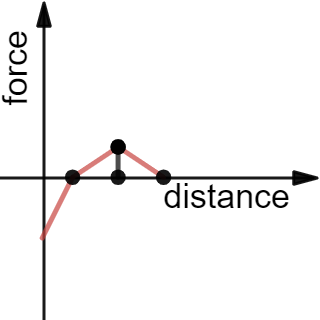

# Force

The force that is applied on a particle when he comes near another particle depends on the following factors:

- r<sub>min</sub>
- r<sub>max</sub>
- the distance (between the two particles)
- the attraction factor (for these two colors)

r<sub>min</sub> and r<sub>max</sub> are universal, they are the same for all particles.<br>
The attraction factor is based on the color of the regarded particle and the approaching particle (details: [Matrix Representation](matrix)).

The rules:

- Particles further apart than r<sub>max</sub> will not interact at all.
- Particles closer than r<sub>min</sub> will repel each other (the closer, the stronger).
- Particles with distance between r<sub>min</sub> and r<sub>max</sub> will attract or repel each other, depending on the attraction factor.

## Force Graph

Click here to play with the force graph:<br>
[](force-graph)

## Implementation

```dart
double getForce(double distance, double rMin, double rMax, double attraction) {

  if (distance < rMin) {
    return distance / rMin - 1;
  }
  
  if (distance < rMax) {
    return attraction * (1 - (2 * distance - rMin - rMax).abs() / (rMax - rMin));
  }
  
  return 0;
}
```
