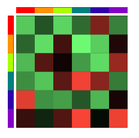

# Matrix Representation

Since the behaviour of particle types here only differs by one number - the [attraction factor](force.html) -, a specific set of rules for *n* particle types can be represented by exactly one *n*-by-*n* matrix.

If that matrix is the same, the emerging structures will always look and behave similarly.

In the user interface, the numbers in the matrix are representated by colors: *Red* for *very negative*, *green* for *very positive*, *black* for *zero*.

## Reading Direction

The **row** specifies the **reacting** particle type. The **column** specifies the **other** particle type which the particle type of that row is reacting to. The number in that cell is the **attraction factor** for that relation.

## Example

To find out how red particles react to violet particles, look in the **first row** (red color) and the **last column** (violet color). If there is a positive number, red particles will move toward violet particles when nearby. If there is a negative number, red particles will be repelled by violet particles when nearby. 
This doesn't say anything about the behaviour of violet particles though.

The main diagonal specifies how much a particle type is attracted to its own kind.
